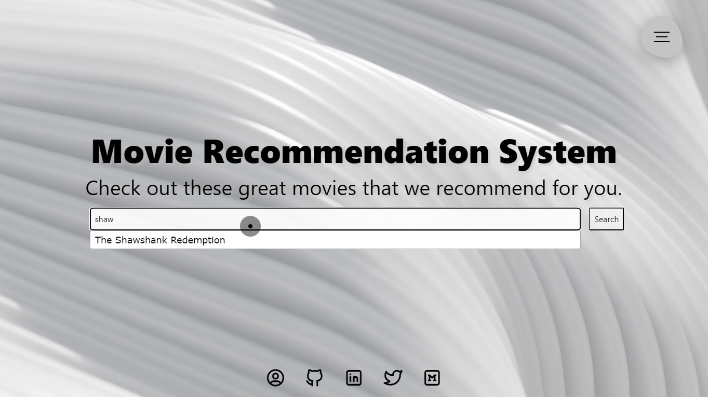

# Movie Recommendation System (MRS)

This repository contains all the project files and necessary details about applications required to run the project on your local machine as well as host it as a Django Application on your Server/Domain.
<hr>

## 1. Demo :movie_camera:

1. Sample Screenshots

   1. Home Screen

      

   2. Navigation Screen

      

   3. Search with Auto Suggestion

      

   4. Recommended Movies

      


<hr>

## 2. Requirements :heavy_check_mark:

To build this project without any errors/issues, the following requirements needs to be satisfied

1. Create a Virtual Environment using python>=3.8 (Tested on 3.9.16)

2. Install the dependencies from the requirements text file from the repository.

<hr>

## 3. Model Training :small_red_triangle_down:

#### 3.q Django Web Application Integration

[Here is a detailed blog](https://medium.com/analytics-vidhya/movie-recommendation-system-python-flask-web-application-heroku-deployment-7e39492b640c) explaining about complete approach and directory structure essential to understand Django integration.

<hr>

## 4. Project Guide

#### 4.1 Running it OnRender Free Cloud

[Here is a detailed blog](https://medium.com/analytics-vidhya/movie-recommendation-system-python-flask-web-application-heroku-deployment-7e39492b640c) explaining about complete approach and essential details to deploy not just this application but also any other web-application you like to built.

#### 4.2 Running in Local

Let's start by activating it.

```shell
/path/to/env/bin/activate
```

Once done, you should go to project root directory and run the following command

```she
python manage.py runserver
```

It will take a moment and then show the following output on the terminal.


You can now open your browser and hit the server IP `http://localhost:8000` provided to run the demo on your local system. 

By default, this project will run on Demo model. If you wish to change model, you can train and download the model of your choice using the python notebook to get better or faster recommendations. Once trained, you can integrate by modifying these 2 lines of code inside `recommender/views.py`

```python
Line 5 : movies_data = pd.read_parquet("static/<dataset_name>.parquet")
Line 73: model = pa.parquet.read_table('static/<model_name>.parquet').to_pandas()
```

Note that you have to place dataset and model into the `static` directory.


This code implements a movie recommendation system based on user input. The system provides a simple web interface built on HTML, CSS, and JavaScript libraries. 

Inputs: The user can search for movies by providing a partial or complete movie name. 

Outputs: The system provides movie recommendations based on user input. 

Dependencies: 

* `static/recommender/` -- contains the following CSS files: `cursor.css`, `page.css`, and `navbar.css`
* `static/logo.png` -- the logo of the application
* `static/production ID_4779866.mp4` -- a background video for the web page
* `@tabler/icons@latest/iconfont/tabler-icons.min.css`
* `normalize/5.0.0/normalize.min.css`
* `jquery-ui.css`
* `font-awesome.min.css`
* `bootstrap.min.css`
* `jquery.min.js`
* `jquery-ui.js`

Usage:

1. Open the HTML file in a web browser.
2. Type the name of a movie in the search bar, and the system will provide the movie recommendation. 

Note: Only the top 2.5K movies based on IMBD are present in this system's database.

> **Working on [version 2 of movie recommendation system on new repository](https://github.com/inboxpraveen/movie-recommendation-system-version-2) which can process 1 million movies within similar memory footprints, better recommendations, and diverse selections, with added features like recommendation bucket and mutual sharing. Stay tuned and do not forget to start the repository to reach out to open-source community.**
